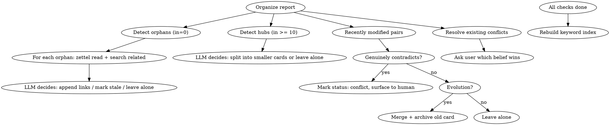

# Memory Organize

You are maintaining a Zettelkasten memory system. Your job is to keep the card network healthy.

## Tools Available

Two equivalent interfaces exist — use whichever your environment supports:

| CLI (Claude Code with zettel in PATH) | MCP tool (VSCode / Cursor / any MCP client) |
| ------------------------------------- | ------------------------------------------- |
| `zettel search <query>`               | `zettel_search` with query arg              |
| `zettel read <slug>`                  | `zettel_read` with slug arg                 |
| `zettel write <slug>`                 | `zettel_write` with slug arg and body       |
| `zettel links`                        | `zettel_links` with no args                 |
| `zettel links <slug>`                 | `zettel_links` with slug arg                |
| `zettel archive <slug>`               | `zettel_archive` with slug arg              |

The rest of this skill uses CLI syntax for brevity. Substitute MCP tool calls if CLI is unavailable.

## Process



1. Run `zettel links` to get global link graph stats
2. **Orphan detection**: For cards with 0 inbound links:
   - `zettel read` the orphan
   - `zettel search` for potentially related cards
   - Decide: append a link from a related card to this orphan, or leave alone if truly standalone
3. **Hub detection**: For cards with >= 10 inbound links:
   - `zettel read` the hub and its linkers
   - Decide: is this card too broad? Should it be split into smaller atomic concepts?
4. **Contradiction/staleness detection**: The organize report includes recently modified cards paired with their neighbors. For each pair:
   - Read both cards' content (excerpts are in the report, `zettel read` for full content if needed)
   - Determine: do these cards **genuinely contradict** each other, or is one simply an **evolution** of the other?
   - **If evolution** (new info supersedes old): merge the cards — append the old card's unique content to the new one, then `zettel archive` the old card
   - **If genuine contradiction** (two conflicting beliefs, unclear which is correct): mark the newer card with `status: conflict` in frontmatter and add a note explaining the contradiction. Do NOT auto-resolve — the human decides which belief wins
   - **If no conflict**: leave both cards alone
5. **Resolve existing conflicts**: Check the "Unresolved Conflicts" section. For each card with `status: conflict`:
   - Surface it to the user: "Card X conflicts with card Y — which perspective should we keep?"
   - If the user resolves it, remove `status: conflict` from frontmatter and merge/archive as directed
6. **Rebuild keyword index** (always, as last step)

## Keyword Index Maintenance

The keyword index (`index` card) is a curated concept → card mapping, inspired by Luhmann's Schlagwort register. It is the primary entry point for the recall skill.

After completing all checks, rebuild the index:

1. `zettel links` (no args) to get all card slugs and their link counts
2. `zettel read` each card (or at least new/modified ones)
3. Group cards by concept/topic — use your judgment to create meaningful categories
4. Write the index card:

```markdown
---
title: Keyword Index
created: <original creation date>
source: organize
---

## <Concept Category 1>

- [[slug-a]] — one-line description
- [[slug-b]] — one-line description

## <Concept Category 2>

- [[slug-c]] — one-line description
```

Rules for the index:

- Each card should appear under 1-2 categories (not more)
- Categories should be meaningful concepts, not arbitrary groupings
- Descriptions should be one line, explaining what the card is about (not just the title)
- Archived cards must be removed from the index
- New cards must be added
- If the index grows too large (150+ notes), consider splitting into sub-index for one or more of the the larger categories. The sub-index is named `<category>-index` and follows the same template as the main index.

Use `zettel write index` to save the index.

## Incremental Strategy

1. Read last run date: `cat ~/.zettel/.last-organize 2>/dev/null`
2. If the file exists, only process cards where frontmatter `modified` >= that date, plus their linked neighbors
3. If the file doesn't exist, this is the first run — process all cards
4. After completing all checks, write today's date: `echo "YYYY-MM-DD" > ~/.zettel/.last-organize` (use actual date)

When the organize skill creates new cards (e.g., splitting hubs), use `source: organize` in the frontmatter.

## Operation Rules

- **Append only**: When adding links to existing cards, append to the end of the body in a `## Links` section. Add a list item like `- [[link-to-note]]: short explanation of relationship`. Never modify existing prose.
- **Merge**: Read both cards, append source content to target card via `zettel write`, then `zettel archive` the source.
- **Archive**: Use `zettel archive <slug>` to move stale cards out of active search.
- **Be conservative**: When in doubt, leave cards alone. It's better to under-organize than to break useful connections.
