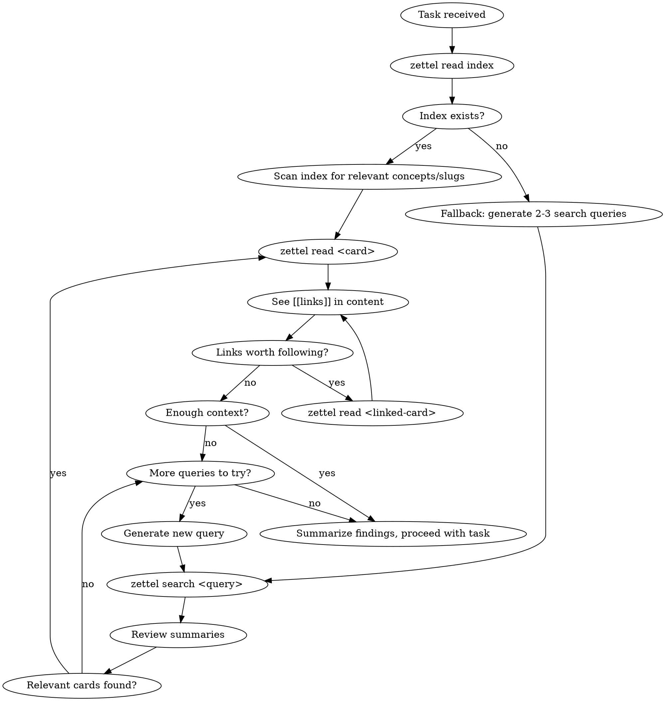

# Memory Recall

You have access to a Zettelkasten memory system via the `zettel` CLI. Before starting this task, search your memory for relevant prior knowledge.

## Tools Available

Two equivalent interfaces exist — use whichever your environment supports:

| CLI (Claude Code with zettel in PATH) | MCP tool (VSCode / Cursor / any MCP client) |
| ------------------------------------- | ------------------------------------------- |
| `zettel read index`                   | `zettel_read` with slug `index`             |
| `zettel search <query>`               | `zettel_search` with query arg              |
| `zettel read <slug>`                  | `zettel_read` with slug arg                 |

The rest of this skill uses CLI syntax for brevity. Substitute MCP tool calls if CLI is unavailable.

## Process

### Step 1: Read the keyword index

Run `zettel read index` first. The index is a curated concept → card mapping (Luhmann's Schlagwortregister). It's much smaller than all cards combined and gives you the best entry points.

If the index doesn't exist yet (card not found), fall back to Step 2.

### Step 2: Targeted reads or keyword search

- **If index exists**: Pick the most relevant slugs from the index and `zettel read` them directly.
- **If no index**: Generate 2-3 search keywords and run `zettel search <keyword>` for each.

### Step 3: Follow links

When you read a card and see `[[links]]` in the prose, decide if they're worth following. If yes, `zettel read <linked-slug>`.

### Step 4: Summarize and proceed

When you have enough context, summarize your findings and proceed with the task.

## Guardrails

- **max_hops: 3** — Do not follow links more than 3 levels deep
- **max_cards_read: 10** — Do not read more than 20 cards in a single recall
- If you hit either limit, stop and work with what you have

## Counting Rules

- Hop 0 = cards found directly via index or `zettel search`. Following a `[[link]]` from there is hop 1, etc.
- Keep a running count of `zettel read` calls. If you've read 10 cards, stop immediately.

## Important

- Always try `zettel read index` first — it's the fastest path to relevant cards
- If search returns nothing useful, that's fine — proceed without memory context
- Summarize what you found before proceeding, so the findings are in your context
