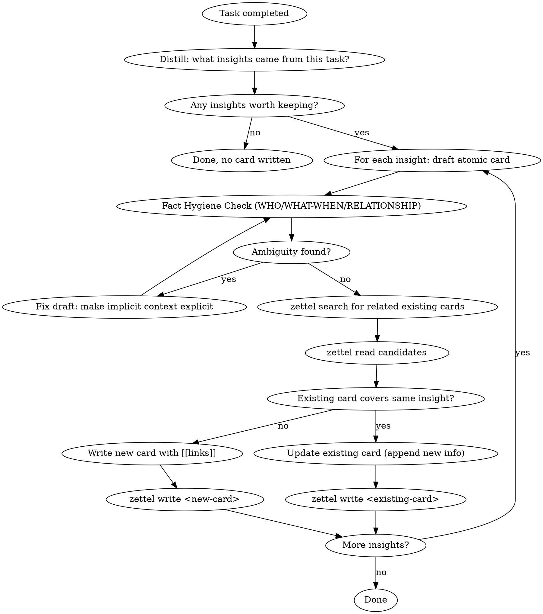

# Memory Retro

You have access to a Zettelkasten memory system via the `zettel` CLI. After completing this task, reflect on what you learned and save valuable insights.

## Tools Available

Two equivalent interfaces exist — use whichever your environment supports:

| CLI (Claude Code with zettel in PATH) | MCP tool (VSCode / Cursor / any MCP client) |
| ------------------------------------- | ------------------------------------------- |
| `zettel search <query>`               | `zettel_search` with query arg              |
| `zettel read <slug>`                  | `zettel_read` with slug arg                 |
| `zettel write <slug>`                 | `zettel_write` with slug arg and body       |

The rest of this skill uses CLI syntax for brevity. Substitute MCP tool calls if CLI is unavailable.

## Process



1. Ask yourself: what did I learn from this task that would be useful in the future?
2. If nothing worth remembering, skip — not every task produces insights
3. For each insight, draft an **atomic card** (one insight per card)
4. **Fact Hygiene Check** — before writing, scan the draft for implicit context that a stranger (or future AI) couldn't decode. Ask three questions:
   - **WHO**: Every project/product/team mentioned — is it the user's own work or external? Would a reader with zero context know?
   - **WHAT-WHEN**: Every number (days, tokens, cost) — is it bound to a specific project name and time period?
   - **RELATIONSHIP**: Words like "based on/refers to/reference" — spell out the actual relationship (authored, benchmarked against, forked from, inspired by, etc.)
   - If any answer is "a stranger couldn't tell", **fix the draft before writing**. One sentence of context prevents hallucinated narratives downstream.
5. Before writing, `zettel search` for related existing cards
6. **Dedup check**: If an existing card already covers this insight, `zettel read` it, then update it by appending new information (use `zettel write` with the full updated content)
7. If it's genuinely new, write a new card with `[[links]]` to related cards in the prose

## Card Format

```markdown
---
title: <descriptive title>
created: <today's date YYYY-MM-DD>
source: <auto-filled by client>
category: <optional category>
tags: <optional tags>
---

<One atomic insight, written in your own words.>

<Natural language sentences with [[links]] to related cards, explaining WHY they're related.>
```

Note: You do NOT need to include `modified` — the CLI auto-sets it on write.

## Rules

- **Atomic**: One insight/subject per card. If you have 3 insights, write 3 cards.
- **Own words**: Don't copy-paste. Distill and rephrase.
- **Link in context**: `[[links]]` must be embedded in sentences that explain the relationship.
  - Good: "This contradicts what we found in [[jwt-migration]] — stateless tokens can't be revoked."
  - Bad: "Related: [[jwt-migration]]"
- **Slug**: English kebab-case, descriptive. e.g., `jwt-revocation-blacklist-pattern`
- **Don't over-record**: Only save insights that would change how you approach a similar task in the future.
  - Good: domain knowledge, architectural decisions, gotcha's, failure modes 
  - Bad: historical record of a bugfix, feature discussion that never landed in the product
- **Preserve frontmatter on update**: When updating an existing card, preserve its original frontmatter fields (title, created). Only append to the body. `source` is auto-managed by the MCP server.
- **Category**: Broad subject category, also used to determine its location within the index
- **Tags**: Add 1-5 tags for the domain and type of knowledge captured in the note.
  - Good: `docker`, `redis`, `api`, `queues` and `decision`, `pattern`, `gotcha`
  - Bad: `bug`, `product`, `database-incident-review` (too generic or too specific)

## External Sources

When curating cards from external sources like obsidian/github:

- Use `source: obsidian` (not `source: retro`).
- **Digest, don't copy.** Read the raw memo, extract the genuine insight, rewrite as atomic Zettelkasten card.
- Merge multiple related memos into one card when they're about the same topic.
- Skip low-quality fragments — the bar for external imports is higher than session retro.
- These cards follow the same quality rules above (atomic, own words, linked).
